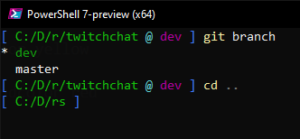

# shortpath
takes a path and shortens it, similar to what fish does

### example:
```
shortpath "c:/some long/path with/multiple/directories/here"

c:/s/p/m/d/here
```

this is useful for shortening paths for a shell prompt 

e.g. for a powershell profile:
```powershell
# in $Profile.ps1
function prompt {
    $path = shortpath (get-location) # shortpath.exe in your $env:PATH
    write-host $path -nonewline -foregroundcolor green
    write-host ">" -nonewline -foregroundcolor blue
    return " "
}
```
and your prompt will be:

